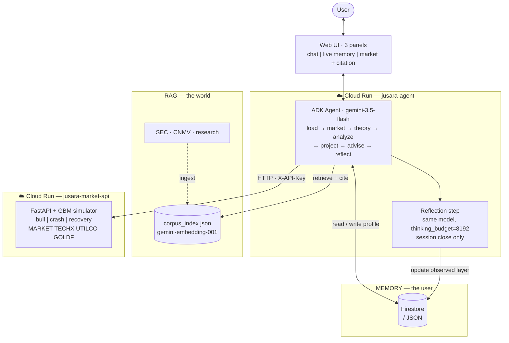

# JUSARA

**An investment copilot that learns the gap between the risk profile you *declare* and the one your
behavior *reveals*.**

Built for the **Collaborative Partner** track of the
[All Things Agentic Hackathon](https://allthingsagentichackathon.devpost.com/) (Gemini / Google Cloud).

> ⚠️ **Educational project. Not regulated financial advice.** All market data is *simulated*. The
> agent never executes trades — every decision stays with the user.

---

## 🚧 Build status

This repository is mid-build for an Aug 31, 2026 deadline. Being precise about what runs today:

| Area | Status |
|---|---|
| Design & research (`docs/`) | ✅ Complete — design doc, corpus sourcing, hackathon rules |
| Foundation (config, deps, Docker) | ✅ `steering.py`, verified model ids |
| Market Simulator API | ✅ **Live on Cloud Run** — deterministic, 43 tests |
| Memory (declared + observed profile) | ✅ Two layers, reinforce/weaken, JSON + Firestore |
| RAG (corpus + retriever) | ✅ 17 documents, 233 chunks, cited retrieval |
| Agent loop, tools, prompts | ✅ Both agents, 13 tools, reflection step |
| CLI + Web UI | ✅ `cli.py` + three-panel page |
| Cloud Run deployment | ✅ **Both services live** |
| Demo script & architecture doc | ⬜ In progress |

The sections below describe the system being built. Anything marked ⬜ or 🟡 above is not runnable yet.

**Live now** — both services are deployed on Cloud Run:

| Service | URL |
|---|---|
| Agent + web UI | https://jusara-agent-904662129922.us-central1.run.app |
| Market simulator | https://jusara-market-api-904662129922.us-central1.run.app |

```bash
curl https://jusara-agent-904662129922.us-central1.run.app/api/health
# {"status":"ok","model":"gemini-3.5-flash","backend":"firestore"}
```

Open the agent URL to talk to it. The market simulator's data endpoints need an
`X-API-Key`; `/health` does not.

---

## The problem

Every brokerage makes you fill out a risk questionnaire. You tick "moderate." That label then drives
the advice you get for years.

But the label is a *self-report*, collected once, in calm conditions, by someone guessing at how
they'd feel about losing money. Then the market drops 20% and the same person tries to sell
everything.

Morningstar's *Mind the Gap 2025* puts a number on the damage: over 2015–2024, fund investors earned
**7.0%** while the funds they held returned **8.2%**. That **1.2 percentage points a year** — roughly
15% of all gains — was destroyed purely by *when* people chose to buy and sell. The gap widens with
volatility and nearly vanishes for investors who hold diversified allocation funds.

The declared profile is not the real one. **The gap is the problem, and nobody is measuring it for you.**

## What JUSARA does differently

Most entries in this track are a chatbot with RAG bolted on. JUSARA keeps **three systems separate,
visible, and auditable**:

| System | What it holds | Where it lives | How you inspect it |
|---|---|---|---|
| **Memory** | *The user.* Declared profile, observed patterns, confidence scores, correction history | `data/memory/{user}.json` locally, Firestore in the cloud | Read the JSON, or watch the Firestore console change |
| **RAG** | *The world.* Investment theory from the SEC, Spain's CNMV, and published research | `data/corpus/` → `data/index/corpus_index.json` | Every answer cites its source institution |
| **Market API** | *The environment.* A deterministic market simulator | Its own Cloud Run service | Call the HTTP endpoints yourself |

The agent is autonomous in **process** — it pulls market data, cross-references theory, projects
outcomes, and decides what to warn you about. It is deliberately *not* autonomous in **execution**.
Human-in-the-loop on money isn't weak agency; it's the correct design.

At the end of every session a **reflection step** rewrites the user's observed profile. That is what
separates memory that *learns* from memory that merely *recalls*.

## Architecture



**Why the simulator is a separate service.** It makes the agent an HTTP client rather than a monolith,
it lets us stress-test the agent against any market condition on demand, and it means the simulator
can evolve without touching the agent. Prices are pre-generated from a **fixed seed**, so the same
call always returns the same result — zero surprises during a live demo.

## The demo: Ana vs. Beto

Two users. Opposite declared profiles. Both seeded with real session history.

|  | **Ana** | **Beto** |
|---|---|---|
| **Declares** | moderate · 10-year horizon | aggressive · 5-year horizon |
| **Actually does** | asked to sell on a 5% dip (s2); wanted everything in cash during volatility (s4) | wanted to concentrate in TECHX (s1); anxious messages on a mild dip (s3) |
| **The gap** | declares moderate, acts conservative under stress | declares aggressive, but red numbers destabilize him more than he admits |

Then the **same `crash` scenario** hits both. The agent ignores the declared label and applies what it
learned:

> **To Ana:** *"I know you want to sell right now — it's what you did in sessions 2 and 4. Before you
> touch anything: your horizon is 10 years. At that scale this drop is noise. Let's talk about why you
> got in."*

> **To Beto:** *"You're going to want to buy the dip and pile into TECHX. Your declared profile would
> allow it, but I've noticed dips unsettle you more than you admit. Let's do this in pieces."*

Same market. Opposite advice. Each anchored in a learned pattern and grounded in a cited source.
**That is the Collaborative Partner.**

The advice to Beto is deliberately non-obvious, and the corpus backs it: Vanguard's research shows
lump-sum investing beats dollar-cost averaging about **two thirds** of the time. So dosing isn't about
maximizing expected return — it's about lowering the odds *he abandons the plan*. The agent can say
that honestly, because the source says it.

## The RAG corpus is real, sourced, and licensed

A hand-written `diversification.md` isn't external knowledge — it's the prompt in disguise. So the
corpus is fetched from named institutions and every chunk carries its provenance:

- **U.S. SEC / Investor.gov** — public domain under 17 U.S.C. §105. Asset allocation, diversification,
  rebalancing, *"Don't Panic, Plan It!"*, the hot-stock/FOMO investor alert.
- **CNMV (Spain)** — reusable under Ley 37/2007 with attribution. Including *"Conozca su perfil como
  inversor"*, the official questionnaire that **produces** a declared profile — the exact instrument
  our thesis interrogates. Spanish PDFs, which is also the messiest input in the pipeline.
- **Cite-only notes** (our summaries, their citations — no copied prose): Morningstar *Mind the Gap*,
  its 2026 rebuttal in the *Financial Analysts Journal*, Odean on the disposition effect,
  Baur & Lucey on gold as a safe haven, Vanguard on cost averaging, Kahneman & Tversky.

Because the corpus contains **both** the behavior-gap finding and its academic rebuttal, the agent
argues rather than recites.

Full source table, licensing tiers, and the ingestion pipeline: **[`docs/corpus_sources.md`](docs/corpus_sources.md)**.

---

## Spin-up instructions

### Prerequisites

- Python 3.11+
- A Google Cloud project with billing enabled, and `gcloud` authenticated
- A Gemini API key (AI Studio) **or** Vertex AI enabled on the project

### 1. Install

```bash
git clone <this-repo>
cd "Hackaton Agentic"

python -m venv .venv
source .venv/Scripts/activate     # Windows (Git Bash)
# source .venv/bin/activate       # macOS / Linux

pip install -e ".[dev]"
```

### 2. Configure

```bash
cp .env.example .env
```

Fill in `.env`:

| Variable | Meaning |
|---|---|
| `GOOGLE_API_KEY` | Gemini API key (or use Vertex via `GOOGLE_GENAI_USE_VERTEXAI=true`) |
| `GOOGLE_CLOUD_PROJECT` | Your GCP project id |
| `GOOGLE_CLOUD_LOCATION` | **Must be `global`.** Gemini 3.5 models 404 on every regional endpoint we tested (`us-central1`, `us-east5`, `europe-west4`, `us-west1`, `asia-northeast1`) |
| `MODEL_DEFAULT` | Gemini 3.5+ Flash model id — confirm with `python cli.py check` |
| `MODEL_COMPLEX_REASONING` | Model for the reflection step. No Pro-class 3.5 model exists on Vertex today, so this is also `gemini-3.5-flash` — escalated via `REFLECTION_THINKING_BUDGET` instead of switching model family |
| `MARKET_API_URL` | Market API base URL (`http://localhost:8081` locally) |
| `MARKET_API_KEY` | Shared secret for the Market API |
| `MEMORY_BACKEND` | `json` (local) or `firestore` (cloud) |

### 3. Verify the environment

```bash
python cli.py check
```

Confirms your model ids exist and that the Gemini API answers. **Run this first** — the contest
mandates Gemini 3.5 or newer, so a wrong model id invalidates the submission.

### 4. Build the knowledge base

```bash
python cli.py fetch-corpus    # downloads SEC pages + CNMV PDFs into data/corpus/
python cli.py ingest          # chunks + embeds → data/index/corpus_index.json
python cli.py seed            # writes data/memory/{ana,beto}.json
```

### 5. Run the market simulator

```bash
uvicorn market_api.main:app --port 8081 --reload
python scripts/smoke_test_api.py --url http://localhost:8081
```

### 6. Run the agent

```bash
python cli.py demo --scenario crash    # the Ana-vs-Beto comparison, end to end
python cli.py run --user ana           # interactive session
```

`demo` labels every `[memory]`, `[rag]`, and `[market]` access as it happens, so you can watch the
three systems work independently.

To see memory **learn**, run `demo` twice and diff the profile:

```bash
git diff data/memory/ana.json
```

The pattern's `confidence` rises and a new `evidence` entry appears. That diff *is* the thesis.

### 7. Web UI

```bash
uvicorn web.app:app --port 8080 --reload   # then open http://localhost:8080
```

### 8. Deploy to Cloud Run

```bash
./market_api/deploy.sh          # deploys jusara-market-api
./deploy/deploy_cloud_run.sh    # deploys jusara-agent (agent + UI)
```

Both deploy with `--min-instances=0` (scale to zero, no idle cost) and a capped `--max-instances`.

### Tests

```bash
pytest
```

Covers simulator determinism, market API auth, the memory schema and its reflection logic, and
cross-lingual retrieval (a Spanish query must retrieve the English SEC guidance).

---

## Project layout

```
collaborative_partner/       # the ADK agent
  agent.py                   # 7-step loop + reflection
  prompts.py                 # role, guardrails, few-shot of the confrontation
  steering.py                # shared config — source of truth for the team
  memory/  schema.py         # UserProfile: declared layer + observed layer
           store.py          # JSON | Firestore behind one interface
  rag/     ingest.py         # chunk + embed
           retriever.py      # cosine search, always returns the source
  tools/   market_tool.py    # HTTP client for the Market API
           memory_tool.py    # read/write the profile
           rag_tool.py       # retrieve theory + citation
           projector.py      # deterministic impact projection (no LLM)

market_api/                  # separate service: FastAPI + seeded GBM simulator
web/                         # FastAPI app + single-page 3-panel UI
data/    corpus/             # fetched sources (committed)
         index/              # embeddings index (committed)
         memory/             # seeded user profiles
scripts/                     # fetch_corpus · ingest_corpus · seed_memory · check_models · smoke_test
docs/    challenge_design.md # full design
         corpus_sources.md   # RAG sources, licensing, ingestion plan
         demo_script.md      # video script
         rules.md            # official contest rules
cli.py                       # check · fetch-corpus · ingest · seed · run · demo
```

## Tech stack & contest compliance

| Mandatory requirement | Where it's satisfied |
|---|---|
| Gemini 3.5 or newer | `gemini-3.5-flash` — verified live against Vertex on 2026-08-29 by `cli.py check`. Note: it is served **only from the `global` endpoint**; every region tested returns 404 |
| A Google agent framework | **Google ADK** (`google-adk` 2.8) — `collaborative_partner/agent.py` |
| A Google Cloud infrastructure service | **Cloud Run** (two services) + **Firestore** (persistent memory) |

## Cost controls

Following the hackathon's own guidance:

- **`gemini-3.5-flash`** for the whole conversational loop. The end-of-session reflection uses the
  same model with a raised **thinking budget** rather than a larger model — cheaper than escalating
  model family, and the only rules-compliant option (no Gemini 3.5 Pro is available on Vertex).
- Cloud Run at **`--min-instances=0`** with a capped ceiling — nothing bills while idle.
- **Serverless retrieval**: a precomputed JSON index and pure-Python cosine similarity. No vector
  database, no always-on cluster, no cold-start embedding cost.
- Memory stores only the essential; long histories are pruned.
- Every public endpoint is behind an API key.

## Disclaimer

JUSARA is an **educational** project. Market data is **simulated** and does not represent any real
security. Nothing here is regulated financial advice. The agent never places trades, and never says
"buy X" — it says "here's what your pattern suggests you consider." Every decision is the user's.

---

## Further reading

- [`docs/challenge_design.md`](docs/challenge_design.md) — full design document
- [`docs/corpus_sources.md`](docs/corpus_sources.md) — RAG sources, licensing, ingestion
- [`docs/demo_script.md`](docs/demo_script.md) — demo video script
- [`docs/hackathon-agentic.md`](docs/hackathon-agentic.md) — hackathon context and track choice
- [`docs/rules.md`](docs/rules.md) — official contest rules
- [`CLAUDE.md`](CLAUDE.md) — working context for Claude Code in this repo
